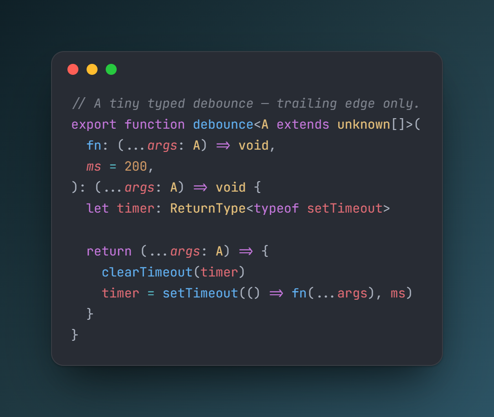
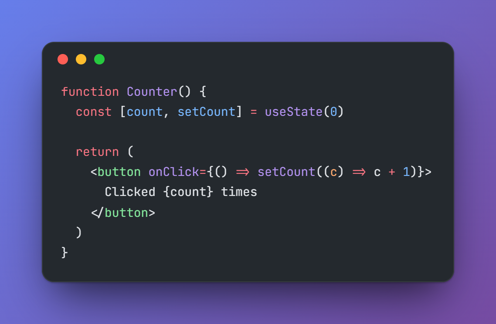
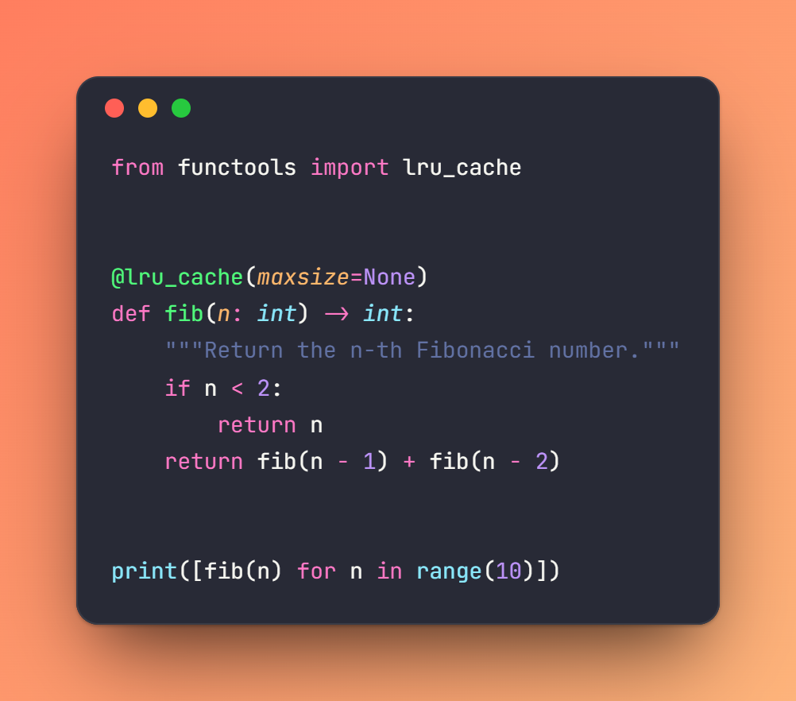
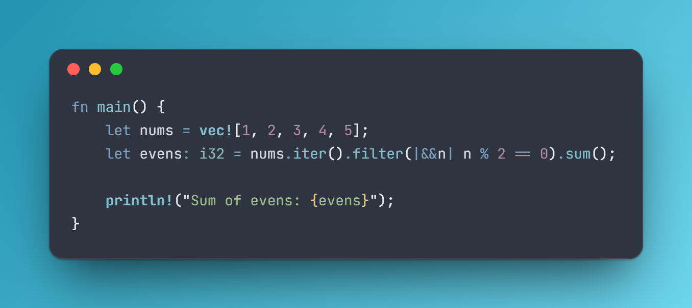

<div align="center">

# SnapCode

**Turn a snippet of source code into a beautiful, shareable image.**

The open-source, no-login, self-hostable answer to carbon.now.sh and ray.so.




</div>

## What is this?

SnapCode is a single-page web app: **paste code → pick a theme and background →
export an editor-grade, high-DPI image** (PNG or SVG) or copy it straight to
your clipboard. Everything runs in your browser — no accounts, no backend, no
tracking, nothing leaves your machine.

The entire value of this project is **how good the exported image looks**, so
two things get disproportionate care:

- **Editor-grade syntax highlighting** via [Shiki](https://shiki.style), which
  uses the same TextMate grammars as VS Code — so output looks like a real
  editor, not a regex approximation.
- **Faithful, crisp image export** — a bundled ligature font that's embedded
  into the output, 2× rendering for high-DPI sharpness, and a single, carefully
  controlled node that gets rasterized.

## Features

- 🎨 **8 curated themes** — GitHub Dark/Light, Nord, Dracula, Vitesse
  Dark/Light, One Dark Pro, Catppuccin Mocha.
- 🧑‍💻 **15 languages** with grammars lazy-loaded on demand (TS/TSX, JS/JSX,
  Python, Rust, Go, Java, JSON, HTML, CSS, Shell, SQL, Markdown, YAML).
- 🖼️ **14 backgrounds** — tasteful gradients, solids, and transparent.
- 🔤 **JetBrains Mono with ligatures**, self-hosted and embedded into exports
  (no system-font fallback surprises).
- 🪟 **macOS-style window chrome**, adjustable padding, rounded corners, shadow.
- 📤 **Export to PNG & SVG**, or **copy to clipboard** as an image.
- ⌨️ **Keyboard friendly** — `Cmd/Ctrl + S` to export, `Tab`/`Shift+Tab` to
  indent in the editor.
- 📱 Responsive, and **100% static** — deploy it anywhere.

## Examples

<table>
  <tr>
    <td></td>
    <td></td>
  </tr>
  <tr>
    <td align="center"><sub>TSX · GitHub Dark · Grape</sub></td>
    <td align="center"><sub>Python · Dracula · Sunset</sub></td>
  </tr>
  <tr>
    <td colspan="2"></td>
  </tr>
  <tr>
    <td colspan="2" align="center"><sub>Rust · Nord · Ocean</sub></td>
  </tr>
</table>

## Quick start

```bash
git clone <your-fork-url> snapcode
cd snapcode
npm install
npm run dev
```

Then open the URL Vite prints (default <http://localhost:5173>).

### Scripts

| Script              | What it does                       |
| ------------------- | ---------------------------------- |
| `npm run dev`       | Start the dev server with HMR      |
| `npm run build`     | Type-check and build to `dist/`    |
| `npm run preview`   | Serve the production build locally |
| `npm run typecheck` | `tsc` in strict mode, no emit      |
| `npm run lint`      | ESLint over the project            |
| `npm run format`    | Prettier write                     |

## Usage

1. **Paste or edit** code in the left panel.
2. **Pick** a language, theme, background, padding, and toggle the window chrome
   in the toolbar.
3. **Export** with the buttons in the top-right: **Copy** (to clipboard),
   **SVG**, or **Export PNG**. `Cmd/Ctrl + S` also exports a PNG.

Exports are named `snapcode-<timestamp>.png` / `.svg`.

## Build & deploy

SnapCode builds to a fully static site in `dist/` — host it on anything.

```bash
npm run build      # outputs to dist/
npm run preview    # sanity-check the build locally
```

- **Vercel** — a [`vercel.json`](./vercel.json) is included; import the repo and
  it deploys with zero extra config.
- **Netlify / Cloudflare Pages / GitHub Pages / any static host** — build
  command `npm run build`, publish directory `dist`. (For GitHub Pages served
  from a subpath, set Vite's [`base`](https://vite.dev/config/shared-options.html#base).)
- **Self-host** — serve the `dist/` folder with any static file server (nginx,
  Caddy, `npx serve dist`, …).

## Architecture

The project keeps a clean boundary so a future headless/CLI export path stays
cheap to add:

```
src/
  core/        # framework-agnostic: Shiki highlighter, themes, languages,
               # backgrounds, settings types — NO React imports
  lib/         # React glue: settings hook, highlight hook, image export
  components/  # Editor, PreviewCard (the one exportable node), Toolbar, ExportBar
  fonts/       # self-hosted JetBrains Mono (woff2) + OFL license
```

Two principles do the heavy lifting:

- **One exportable node.** Exactly one DOM element — the preview card
  (`#snap-preview-card`) — gets rasterized. Everything visual lives inside it,
  so the export captures the preview faithfully.
- **The highlighter is a singleton.** Shiki is created once as a module-level
  promise (with the pure-JS RegExp engine, so there's no WASM to ship) and
  reused everywhere; themes and grammars load lazily and are cached.

## Roadmap

- **v2: headless / CLI export** via [Satori](https://github.com/vercel/satori) +
  [resvg](https://github.com/yisibl/resvg-js) — the `core/` boundary above is
  designed to make this a small addition.

Out of scope by design: accounts, backends, databases, sharing/permalink
services. v1 is intentionally 100% client-side.

## Contributing

Issues and PRs welcome. Before pushing:

```bash
npm run typecheck && npm run lint && npm run build
```

CI runs the same three checks on every push and pull request
([`.github/workflows/ci.yml`](./.github/workflows/ci.yml)).

The README example images are generated from the live app with
[`scripts/save-image-server.mjs`](./scripts/save-image-server.mjs) — see the
comment at the top of that file.

## License & attribution

- Code: [MIT](./LICENSE).
- Bundled font: **JetBrains Mono**, [SIL Open Font License 1.1](./src/fonts/OFL.txt).
- Syntax highlighting by [Shiki](https://shiki.style); image export by
  [html-to-image](https://github.com/bubkoo/html-to-image).
